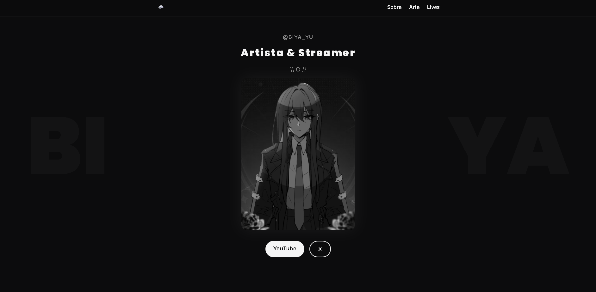

# 🎨 Biya Landing Page

Landing page minimalista e responsiva inspirada em layouts **VTuber / Hololive-like**, criada para apresentar o trabalho e presença da artista **Biya**.



---

## 🌙 Estrutura do Projeto

```

biya-landing/
├── index.html        # Página principal
├── style.css         # Estilos globais (tema escuro + layout responsivo)
├── script.js         # Interações e animações leves
│
└── assets/
├── favicon.png
├── preview-biya.webp
├── biya.png
│
├── shots/        # Artes em vitrine
│   ├── shot1.webp
│   ├── shot2.webp
│   ├── shot3.webp
│   └── shot4.webp
│
└── lives/        # Miniaturas das lives
├── live1.webp
├── live2.webp
└── live3.webp

````

---

## 🧩 Seções

| Seção | Descrição |
|-------|------------|
| **Hero** | Apresenta Biya e seus links principais. |
| **Sobre** | Texto descritivo e humano sobre o processo artístico. |
| **Arte** | Galeria visual com imagens sem legendas — vitrine limpa. |
| **Lives** | Cards clicáveis com links diretos para lives do YouTube. |
| **Footer** | Créditos e links externos. |

---

## 🚀 Como usar localmente
````
1. Baixe ou clone o repositório:

   git clone https://github.com/ZaraTakion/biya-landing.git
   cd biya-landing

2. Abra o arquivo `index.html` no navegador.

3. Substitua as imagens em `assets/` pelos seus arquivos reais (mesmos nomes e formatos).

4. Edite os textos no `index.html` se quiser personalizar seções.
````
---

## 🌐 Publicação

O projeto está publicado via **GitHub Pages**:

➡️ **[https://zaratakion.github.io/biya-landing/](https://zaratakion.github.io/biya-landing/)**

---

## ⚡ Tecnologias

* **HTML5** sem dependências externas
* **CSS3** moderno (Grid + Flexbox)
* **JavaScript** puro (animações e scroll suave)

---

## 📜 Créditos

Design e desenvolvimento: [@ZaraTakion](https://github.com/ZaraTakion)
Arte: **Biya_YU** — conceito e identidade visual.

---

## 🪶 Licença

Este projeto é de uso **pessoal e artístico**.
Não é permitido uso comercial sem autorização prévia da artista.
